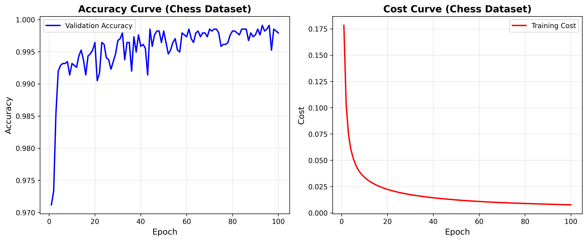
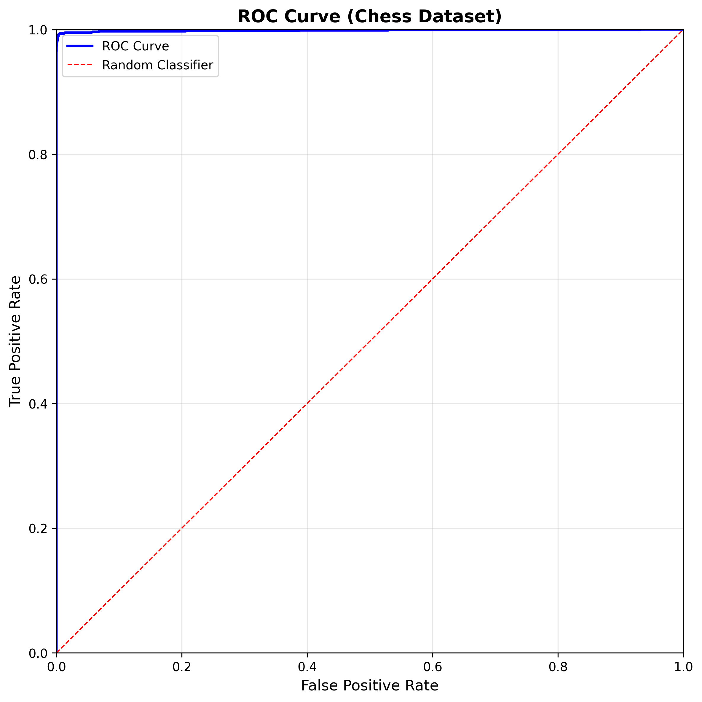

# Assignment 2

> 代码及报告内容见GitHub仓库[https://github.com/zzyMLHW/Assignment2](https://github.com/zzyMLHW/Assignment2)。

## 一、代码修改

### 1. 在`NN.py`中添加新算法内容（详见`NN_new.py`）

```python
import numpy as np

class NN:
    def __init__(self, **arg):
        init = {'layer':[],
                'active_function':'sigmoid', 
                'output_function':'sigmoid', 
                'learning_rate':1.5, 
                'weight_decay':0,
                'cost':{}, 
                'batch_normalization':0,
                'optimization_method':'normal',
                'objective_function':'MSE',
                'rho': 0.9,    
                'alpha': 0.9,  
               }
        
        param = dict() 
        param.update(init)
        param.update(arg)
        self.batch_size = param['batch_size']
        self.size = param['layer'] 
        self.depth = len(self.size)
        self.active_function = param['active_function']
        self.output_function = param['output_function']
        self.learning_rate = param['learning_rate']
        self.weight_decay = param['weight_decay']
        self.cost = param['cost']
        self.batch_normalization = param['batch_normalization']
        self.optimization_method = param['optimization_method']
        self.objective_function = param['objective_function']
        
        self.rho = param['rho']
        self.alpha = param['alpha']

        self.a = dict()

        if self.optimization_method == 'Adam':
            self.AdamTime = 0

        if self.objective_function == 'Cross Entropy':
            self.output_function = 'softmax'

        self.W = dict(); self.b = dict(); self.vW = dict(); self.vb = dict() 
        self.rW = dict(); self.rb = dict(); self.sW = dict(); self.sb = dict() 
        self.E = dict(); self.S = dict(); self.Gamma = dict(); self.Beta = dict()
        self.vGamma = dict(); self.rGamma = dict(); self.vBeta = dict(); self.rBeta = dict(); 
        self.sGamma = dict(); self.sBeta = dict(); self.W_grad = dict(); self.b_grad = dict(); self.delta = dict()
        self.Gamma_grad = dict(); self.Beta_grad = dict()
        
        for k in range(self.depth - 1):
            width = self.size[k]
            height = self.size[k + 1]
            self.W[k] = 2 * np.random.rand(height, width) / np.sqrt(width) - 1 / np.sqrt(width)

            if self.active_function == 'relu':
                self.b[k] = np.random.rand(height, 1) + 0.01
            else:
                self.b[k] = 2 * np.random.rand(height, 1) / np.sqrt(width) - 1 / np.sqrt(width)
            method = self.optimization_method

            if method == 'Momentum' or method == 'RMSProp_Nesterov':
                self.vW[k] = np.zeros((height, width), dtype=float)
                self.vb[k] = np.zeros((height, 1), dtype=float)

            if method == 'AdaGrad' or method == 'RMSProp' or method == 'Adam' or method == 'RMSProp_Nesterov':
                self.rW[k] = np.zeros((height, width), dtype=float)
                self.rb[k] = np.zeros((height, 1), dtype=float)

            if method == 'Adam':
                self.sW[k] = np.zeros((height, width), dtype=float)
                self.sb[k] = np.zeros((height, 1), dtype=float)

            # parameters for batch normalization.
            if self.batch_normalization:
                self.E[k] = np.zeros((height, 1), dtype=float)
                self.S[k] = np.zeros((height, 1), dtype=float)
                self.Gamma[k] = 1
                self.Beta[k] = 0
                self.vecNum = 0
                
                if method == 'Momentum' or method == 'RMSProp_Nesterov':
                    self.vGamma[k] = 1
                    self.vBeta[k] = 0
                    if method == 'RMSProp_Nesterov':
                         self.vGamma[k] = 0

                if method == 'AdaGrad' or method == 'RMSProp' or method == 'Adam' or method == 'RMSProp_Nesterov':
                    self.rW[k] = np.zeros((height, width), dtype=float)
                    self.rb[k] = np.zeros((height, 1), dtype=float)
                    self.rGamma[k] = 0
                    self.rBeta[k] = 0   

                if method == 'Adam':
                    self.sGamma[k] = 1
                    self.sBeta[k] = 0
```

### 2. 对`nn_applygradient.py`进行适配（详见`nn_applygradient_new.py`)

```python
import numpy as np

def nn_applygradient(nn):
    method = nn.optimization_method
    
    if method == 'RMSProp_Nesterov':
        rho = getattr(nn, 'rho', 0.9)
        alpha = getattr(nn, 'alpha', 0.9)
        eps = 1e-5
        
    if method == 'AdaGrad' or method == 'RMSProp' or method == 'Adam' or method == 'RMSProp_Nesterov':
        grad_squared = 0
        if nn.batch_normalization == 0:
            for k in range(nn.depth-1):
                grad_squared = grad_squared + sum(sum(nn.W_grad[k]**2)) + sum(nn.b_grad[k]**2)
        else:
            for k in range(nn.depth-1):
                grad_squared = grad_squared + sum(sum(nn.W_grad[k]**2)) + sum(nn.b_grad[k]**2) + nn.Gamma[k]**2 + nn.Beta[k]**2

    if method == 'Adam':
        nn.AdamTime +=1

    for k in range(nn.depth-1):
        if nn.batch_normalization == 0:
            if method == 'normal':
                nn.W[k] = nn.W[k] - nn.learning_rate*nn.W_grad[k]
                nn.b[k] = nn.b[k] - nn.learning_rate*nn.b_grad[k]
                
            elif method == 'AdaGrad':
                nn.rW[k] = nn.rW[k] + nn.W_grad[k]**2
                nn.rb[k] = nn.rb[k] + nn.b_grad[k]**2
                nn.W[k] = nn.W[k] - nn.learning_rate*nn.W_grad[k]/(np.sqrt(nn.rW[k]) + 0.001)
                nn.b[k] = nn.b[k] - nn.learning_rate*nn.b_grad[k]/(np.sqrt(nn.rb[k]) + 0.001)
                
            elif method == 'Momentum':
                rho = 0.1 #rho = 0.1
                nn.vW[k] = rho * nn.vW[k] + nn.W_grad[k]
                nn.vb[k] = rho * nn.vb[k] + nn.b_grad[k]
                nn.W[k] = nn.W[k] -nn.learning_rate*nn.vW[k]
                nn.b[k] = nn.b[k] -nn.learning_rate*nn.vb[k]

            elif method == 'RMSProp':
                rho = 0.9 #rho = 0.9
                nn.rW[k] = rho * nn.rW[k] + (1-rho)*nn.W_grad[k]**2
                nn.rb[k] = rho * nn.rb[k] + (1-rho)*nn.b_grad[k]**2
                nn.W[k] = nn.W[k] - nn.learning_rate*nn.W_grad[k]/(np.sqrt(nn.rW[k]) + 0.001)
                nn.b[k] = nn.b[k] - nn.learning_rate*nn.b_grad[k]/(np.sqrt(nn.rb[k]) + 0.001) #rho = 0.9
            
            elif method == 'RMSProp_Nesterov':
                vW_old = nn.vW[k]
                nn.rW[k] = rho * nn.rW[k] + (1 - rho) * nn.W_grad[k]**2
                nn.vW[k] = alpha * nn.vW[k] - (nn.learning_rate / (np.sqrt(nn.rW[k]) + eps)) * nn.W_grad[k]
                nn.W[k] = nn.W[k] - alpha * vW_old + (1 + alpha) * nn.vW[k]
                
                vb_old = nn.vb[k]
                nn.rb[k] = rho * nn.rb[k] + (1 - rho) * nn.b_grad[k]**2
                nn.vb[k] = alpha * nn.vb[k] - (nn.learning_rate / (np.sqrt(nn.rb[k]) + eps)) * nn.b_grad[k]
                nn.b[k] = nn.b[k] - alpha * vb_old + (1 + alpha) * nn.vb[k]

            elif method == 'Adam':
                rho1 = 0.9
                rho2 = 0.999
                nn.sW[k] = rho1*nn.sW[k] + (1-rho1)*nn.W_grad[k]
                nn.sb[k] = rho1*nn.sb[k] + (1-rho1)*nn.b_grad[k]
                nn.rW[k] = rho2*nn.rW[k] + (1-rho2)*nn.W_grad[k]**2
                nn.rb[k] = rho2*nn.rb[k] + (1-rho2)*nn.b_grad[k]**2

                newS = nn.sW[k] / (1 - rho1**nn.AdamTime)
                newR = nn.rW[k] / (1 - rho2**nn.AdamTime)
                nn.W[k] = nn.W[k] - nn.learning_rate*newS/np.sqrt(newR + 0.00001)
                newS = nn.sb[k] / (1 - rho1**nn.AdamTime)
                newR = nn.rb[k] / (1 - rho2**nn.AdamTime)
                nn.b[k] = nn.b[k] -nn.learning_rate*newS/np.sqrt(newR + 0.00001)#rho1 = 0.9, rho2 = 0.999, delta = 0.00001

        else: # Has Batch Normalization
            if method == 'normal':
                nn.W[k] = nn.W[k] - nn.learning_rate*nn.W_grad[k]
                nn.b[k] = nn.b[k] - nn.learning_rate*nn.b_grad[k]
                nn.Gamma[k] = nn.Gamma[k] - nn.learning_rate*nn.Gamma_grad[k]
                nn.Beta[k] = nn.Beta[k] - nn.learning_rate*nn.Beta_grad[k]
                
            elif method == 'AdaGrad':
                nn.rW[k] = nn.rW[k] + nn.W_grad[k]**2
                nn.rb[k] = nn.rb[k] + nn.b_grad[k]**2
                nn.rGamma[k] = nn.rGamma[k] + nn.Gamma_grad[k]**2
                nn.rBeta[k] = nn.rBeta[k] + nn.Beta_grad[k]**2
                nn.W[k] = nn.W[k] - nn.learning_rate*nn.W_grad[k]/(np.sqrt(nn.rW[k]) + 0.001)
                nn.b[k] = nn.b[k] - nn.learning_rate*nn.b_grad[k]/(np.sqrt(nn.rb[k]) + 0.001)
                nn.Gamma[k] = nn.Gamma[k] - nn.learning_rate*nn.Gamma_grad[k] / (np.sqrt(nn.rGamma[k]) + 0.001)
                nn.Beta[k] = nn.Beta[k] - nn.learning_rate*nn.Beta_grad[k] / (np.sqrt(nn.rBeta[k]) + 0.001)
                
            elif method == 'RMSProp':
                nn.rW[k] = 0.9*nn.rW[k] + 0.1*nn.W_grad[k]**2
                nn.rb[k] = 0.9*nn.rb[k] + 0.1*nn.b_grad[k]**2
                nn.rGamma[k] = 0.9*nn.rGamma[k] + 0.1*nn.Gamma_grad[k]**2
                nn.rBeta[k] = 0.9*nn.rBeta[k] + 0.1*nn.Beta_grad[k]**2
                nn.W[k] = nn.W[k] - nn.learning_rate*nn.W_grad[k]/(np.sqrt(nn.rW[k]) + 0.001)
                nn.b[k] = nn.b[k] - nn.learning_rate*nn.b_grad[k]/(np.sqrt(nn.rb[k]) + 0.001)
                nn.Gamma[k] = nn.Gamma[k] - nn.learning_rate*nn.Gamma_grad[k] / (np.sqrt(nn.rGamma[k]) + 0.001)
                nn.Beta[k] = nn.Beta[k] - nn.learning_rate*nn.Beta_grad[k] / (np.sqrt(nn.rBeta[k]) + 0.001) #rho = 0.9

            elif method == 'RMSProp_Nesterov':
                vW_old = nn.vW[k]
                nn.rW[k] = rho * nn.rW[k] + (1 - rho) * nn.W_grad[k]**2
                nn.vW[k] = alpha * nn.vW[k] - (nn.learning_rate / (np.sqrt(nn.rW[k]) + eps)) * nn.W_grad[k]
                nn.W[k] = nn.W[k] - alpha * vW_old + (1 + alpha) * nn.vW[k]
                
                vb_old = nn.vb[k]
                nn.rb[k] = rho * nn.rb[k] + (1 - rho) * nn.b_grad[k]**2
                nn.vb[k] = alpha * nn.vb[k] - (nn.learning_rate / (np.sqrt(nn.rb[k]) + eps)) * nn.b_grad[k]
                nn.b[k] = nn.b[k] - alpha * vb_old + (1 + alpha) * nn.vb[k]
                
                vGamma_old = nn.vGamma[k]
                nn.rGamma[k] = rho * nn.rGamma[k] + (1 - rho) * nn.Gamma_grad[k]**2
                nn.vGamma[k] = alpha * nn.vGamma[k] - (nn.learning_rate / (np.sqrt(nn.rGamma[k]) + eps)) * nn.Gamma_grad[k]
                nn.Gamma[k] = nn.Gamma[k] - alpha * vGamma_old + (1 + alpha) * nn.vGamma[k]
                
                vBeta_old = nn.vBeta[k]
                nn.rBeta[k] = rho * nn.rBeta[k] + (1 - rho) * nn.Beta_grad[k]**2
                nn.vBeta[k] = alpha * nn.vBeta[k] - (nn.learning_rate / (np.sqrt(nn.rBeta[k]) + eps)) * nn.Beta_grad[k]
                nn.Beta[k] = nn.Beta[k] - alpha * vBeta_old + (1 + alpha) * nn.vBeta[k]

            elif method == 'Momentum':
                rho = 0.1
                nn.vW[k] = rho * nn.vW[k] + nn.W_grad[k]
                nn.vb[k] = rho * nn.vb[k] + nn.b_grad[k]
                nn.vGamma[k] = rho * nn.vGamma[k] + nn.Gamma_grad[k]
                nn.vBeta[k] = rho * nn.vBeta[k] + nn.Beta_grad[k]
                nn.W[k] = nn.W[k] - nn.learning_rate*nn.vW[k]
                nn.b[k] = nn.b[k] - nn.learning_rate*nn.vb[k]
                nn.Gamma[k] = nn.Gamma[k] -nn.learning_rate*nn.vGamma[k]
                nn.Beta[k] = nn.Beta[k] -nn.learning_rate*nn.vBeta[k]

            elif method == 'Adam':
                rho1 = 0.9
                rho2 = 0.999
                nn.sW[k] = rho1*nn.sW[k] + (1-rho1)*nn.W_grad[k]
                nn.sb[k] = rho1*nn.sb[k] + (1-rho1)*nn.b_grad[k]
                nn.sGamma[k] = rho1*nn.sGamma[k] + (1-rho1)*nn.Gamma_grad[k]
                nn.sBeta[k] = rho1*nn.sBeta[k] + (1-rho1)*nn.Beta_grad[k]
                nn.rW[k] = rho2*nn.rW[k] + (1-rho2)*nn.W_grad[k]**2
                nn.rb[k] = rho2*nn.rb[k] + (1-rho2)*nn.b_grad[k]**2
                nn.rBeta[k] = rho2*nn.rBeta[k] + (1-rho2)*nn.Beta_grad[k]**2
                nn.rGamma[k] = rho2*nn.rGamma[k] + (1-rho2)*nn.Gamma_grad[k]**2

                newS = nn.sW[k]/(1 - rho1**nn.AdamTime)
                newR = nn.rW[k]/(1 - rho2**nn.AdamTime)
                nn.W[k] = nn.W[k]-nn.learning_rate * newS/np.sqrt(newR + 0.00001)
                newS = nn.sb[k]/(1 - rho1**nn.AdamTime)
                newR = nn.rb[k]/(1 - rho2**nn.AdamTime)
                nn.b[k] = nn.b[k] -nn.learning_rate * newS/np.sqrt(newR + 0.00001)
                newS = nn.sGamma[k] / (1 - rho1 ** nn.AdamTime)
                newR = nn.rGamma[k] / (1 - rho2 ** nn.AdamTime)
                nn.Gamma[k] = nn.Gamma[k] - nn.learning_rate*newS/np.sqrt(newR + 0.00001)
                newS = nn.sBeta[k] / (1 - rho1 ** nn.AdamTime)
                newR = nn.rBeta[k] / (1 - rho2 ** nn.AdamTime)
                nn.Beta[k] = nn.Beta[k] -nn.learning_rate*newS/np.sqrt(newR + 0.00001)
    return nn
```

### 3. 对`nn_train.py`进行适配（详见`nn_train_new.py`）

```python
import numpy as np
from nn_forward import nn_forward
from nn_backward import nn_backward
from nn_applygradient_new import nn_applygradient

def nn_train(nn,train_x,train_y):
    batch_size = nn.batch_size
    m = train_x.shape[0]
    num_batches = m / batch_size
    kk = np.random.permutation(m)
    for l in range(int(num_batches)):
        batch_x = train_x[kk[l * batch_size : (l + 1) * batch_size], :] 
        batch_y = train_y[kk[l * batch_size : (l + 1) * batch_size], :]
        nn = nn_forward(nn,batch_x,batch_y)
        nn = nn_backward(nn,batch_y)
        nn = nn_applygradient(nn)
    return nn
```

## 二、兵王问题测试

测试代码见`testChess.py`，其运行后得到的训练曲线如下图所示：



ROC曲线如下图所示：



## 三、在MNIST数据集上与Momentum方法对比

训练曲线对比如图所示：


## 四、RMSProp_Nesterov 与 Momentum 方法优劣分析

### 1. RMSProp_Nesterov 方法

#### 优势：

1. **自适应学习率**：RMSProp_Nesterov 结合了 RMSProp 的自适应学习率机制，能够根据每个参数的历史梯度平方和动态调整学习率。这使得不同参数可以使用不同的有效学习率，特别适合处理非平稳目标函数和稀疏梯度问题。

2. **Nesterov 加速**：通过 Nesterov 加速梯度方法，算法能够"前瞻"一步，在更新参数时考虑未来梯度方向，从而减少震荡并加快收敛速度。这使得算法在优化过程中更加稳定和高效。

3. **更好的收敛性能**：结合了自适应学习率和 Nesterov 加速的优势，RMSProp_Nesterov 通常能够在更少的迭代次数内达到更好的收敛效果，特别是在复杂的非凸优化问题中表现优异。

4. **对超参数鲁棒性**：相比单纯的 Momentum 方法，RMSProp_Nesterov 对学习率的选择更加鲁棒，因为自适应机制能够自动调整每个参数的有效学习率。

#### 劣势：

1. **计算复杂度较高**：需要维护额外的状态变量（如梯度平方的指数移动平均 `rW`、`rb` 等），计算开销略大于 Momentum 方法。

2. **超参数调优**：需要同时调整 `rho`（RMSProp 衰减率）和 `alpha`（Nesterov 动量系数）两个超参数，增加了调参的复杂度。

3. **内存占用**：需要存储更多的中间变量（速度项 `vW`、`vb` 和梯度平方项 `rW`、`rb`），内存占用相对较大。

### 2. Momentum 方法

#### 优势：

1. **简单高效**：Momentum 方法实现简单，计算开销小，只需要维护速度项 `vW`、`vb`，内存占用较少。

2. **加速收敛**：通过累积历史梯度信息，Momentum 能够在梯度方向一致时加速收敛，在梯度方向改变时减少震荡。

3. **超参数少**：只需要调整动量系数 `rho` 和学习率 `learning_rate` 两个超参数，调参相对简单。

4. **稳定性好**：对于简单的优化问题，Momentum 方法通常能够提供稳定可靠的性能。

#### 劣势：

1. **固定学习率**：所有参数使用相同的学习率，无法根据参数的重要性或梯度大小自适应调整，在处理不同尺度的参数时可能不够灵活。

2. **收敛速度较慢**：相比自适应方法，Momentum 在复杂优化问题上的收敛速度可能较慢，特别是在损失函数具有不同曲率的区域。

3. **对学习率敏感**：需要仔细调整学习率，学习率过大可能导致震荡，学习率过小则收敛缓慢。

4. **缺乏前瞻性**：标准的 Momentum 方法没有 Nesterov 加速的前瞻机制，在某些情况下可能不如 Nesterov 加速版本高效。

从 MNIST 数据集上的对比实验可以看出，RMSProp_Nesterov 方法在训练过程中通常能够：
- 更快地达到较高的准确率
- 训练损失下降更加平滑
- 在验证集上表现更加稳定

这表明 RMSProp_Nesterov 方法在处理复杂深度学习任务时具有明显的优势，特别是在需要快速收敛和稳定训练的场景下。

